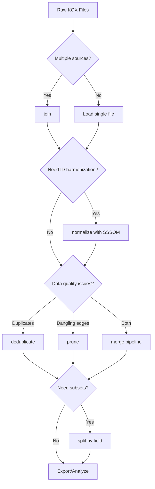

# Graph Operations

Graph operations provide a suite of tools for building, transforming, and analyzing knowledge graphs in KGX format. Built on DuckDB for high performance, these operations handle the complete lifecycle from raw data files to production-ready graphs.

## Quick Start

Combine multiple KGX files into a single graph:

```bash
koza join \
  --nodes source1_nodes.tsv source2_nodes.tsv \
  --edges source1_edges.tsv source2_edges.tsv \
  --output my_graph.duckdb
```

## When to Use Each Operation



| Operation | Use When You Need To... |
|-----------|------------------------|
| **join** | Combine multiple KGX files into one database |
| **split** | Extract subsets by field value (e.g., by source) |
| **merge** | Run complete pipeline: join → deduplicate → normalize → prune |
| **normalize** | Apply SSSOM mappings to harmonize identifiers |
| **deduplicate** | Remove duplicate nodes/edges by ID |
| **prune** | Clean up dangling edges and singleton nodes |
| **append** | Add new data to existing database |

## Documentation Sections

<div class="grid cards" markdown>

-   :material-school: **[Tutorials](tutorials/index.md)**

    ---

    Step-by-step lessons for learning graph operations from scratch.

    [:octicons-arrow-right-24: Start learning](tutorials/index.md)

-   :material-directions: **[How-to Guides](how-to/index.md)**

    ---

    Practical recipes for specific tasks and common workflows.

    [:octicons-arrow-right-24: Find solutions](how-to/index.md)

-   :material-book-open-variant: **[Reference](reference/index.md)**

    ---

    Technical documentation for CLI commands, Python API, and configuration.

    [:octicons-arrow-right-24: Look up details](reference/index.md)

-   :material-lightbulb: **[Explanation](explanation/index.md)**

    ---

    Background concepts and architectural decisions explained.

    [:octicons-arrow-right-24: Understand more](explanation/index.md)

</div>

## Key Features

- **Multi-format support**: TSV, JSONL, and Parquet files
- **Schema harmonization**: Automatic handling of different column sets
- **Non-destructive**: Problem data moved to archive tables, never deleted
- **Provenance tracking**: Source attribution for all records
- **SQL access**: Query your graph directly with DuckDB SQL
