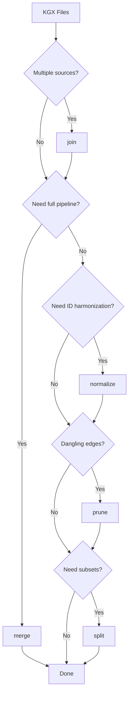

# Graph Operations

Graph operations provide tools for building, transforming, and analyzing knowledge graphs in KGX format. Built on DuckDB, these operations handle the lifecycle from raw data files to merged graphs.

## Quick Start

Combine multiple KGX files into a single graph:

```bash
koza join \
  -n source1_nodes.tsv -n source2_nodes.tsv \
  -e source1_edges.tsv -e source2_edges.tsv \
  -o my_graph.duckdb
```

## When to Use Each Operation



| Operation | Use When You Need To... |
|-----------|------------------------|
| **join** | Combine multiple KGX files into one database |
| **merge** | Run complete pipeline: join → normalize → prune |
| **split** | Extract subsets by field value (e.g., by source) |
| **normalize** | Apply SSSOM mappings to harmonize edge identifiers |
| **prune** | Remove dangling edges and optionally singleton nodes |
| **append** | Add new data to an existing database |

## Documentation Sections

### [Tutorials](tutorials/index.md)
Step-by-step lessons for learning graph operations from scratch.

### [How-to Guides](how-to/index.md)
Practical recipes for specific tasks and common workflows.

### [Reference](reference/index.md)
Technical documentation for CLI commands, Python API, and configuration.

### [Explanation](explanation/index.md)
Background concepts and architectural decisions explained.

## Key Features

- **Supported formats**: TSV, JSONL, and Parquet files
- **Schema harmonization**: Handles different column sets across input files
- **Archive behavior**: Problem data is moved to archive tables, not deleted
- **Provenance tracking**: Records source attribution for all records
- **SQL access**: Graphs can be queried with DuckDB SQL
